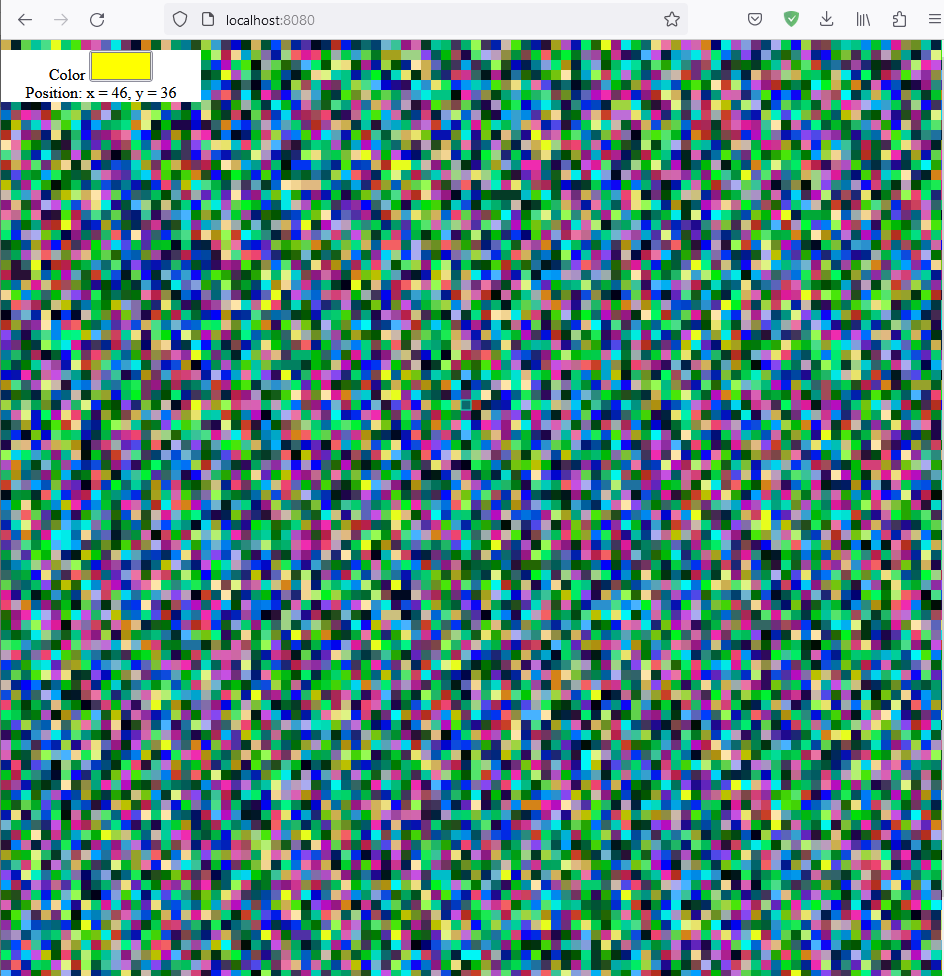

# Pixel Battles
## Постановка задачи
Дана карта 100х100, реализовано REST API для окрашивания клетки в цвет.
Исходно карта выполнена в виде одномерного массива и доступ к нему осуществляется из критической секции.

Требуется оптимизировать конкурентный доступ к карте. Структуру данных для хранения поля можно изменить по вашему усмотрению.

Помимо технической реализации проекта, потребуется ниже описать вашу идею оптимизации и примененные техники.

В тестах приведен пример нагрузочного тестирования. Прежде чем приступать к заданию, стоит замерить производительность образца.
И затем сравнивать результаты после оптимизации.

## Описание идеи
TODO: Заполнить после выполнения

